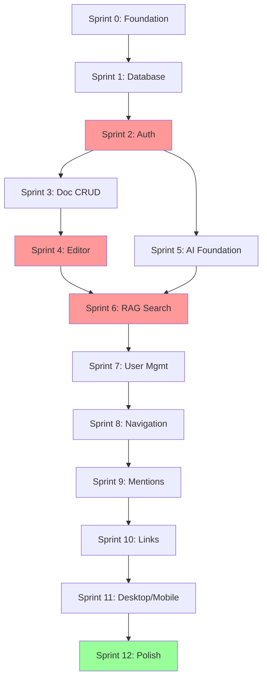

# WRight Now MVP: Sprint Plan & OpenSpec Proposals

**Version:** 1.0  
**Duration:** 6 months (12 sprints × 2 weeks)  
**Team Size:** 3-6 engineers  
**Goal:** Launch production-ready MVP with Founder's LTD

---

## How to Use This Document

For each sprint, you'll find:
1. **Goals** - What you're trying to achieve
2. **Tasks** - Detailed implementation checklist
3. **OpenSpec Proposal Prompt** - Exact phrase to trigger proposal creation
4. **Deliverables** - What's shippable at sprint end

### Using OpenSpec Prompts

When you're ready to start a task, copy-paste the **OpenSpec Proposal Prompt** to trigger proposal creation. For example:

```
You: "Create a proposal to add OIDC authentication with Authentik integration"
AI: [Creates detailed OpenSpec proposal with specs, tasks, design docs]
You: [Review and approve]
AI: [Implements in Act Mode]
```

---

## Sprint 0: Foundation & Infrastructure

**Duration:** Weeks 1-2  
**Goal:** Set up development infrastructure, DevOps pipeline, and project scaffolding

### Tasks & OpenSpec Prompts

| # | Task | OpenSpec Proposal Prompt |
|---|------|--------------------------|
| **1** | **DevOps Setup** | |
| 1.1 | Set up GitHub repository with branch protection | "Create a proposal to add GitHub repository setup with GitFlow-lite branching and protection rules" |
| 1.2 | Configure GitHub Actions CI/CD pipeline | "Create a proposal to add CI/CD pipeline with GitHub Actions for linting, testing, and Docker builds" |
| 1.3 | Set up Docker Compose for local development | "Create a proposal to add Docker Compose development environment with PostgreSQL, Redis, and Authentik" |
| 1.4 | Configure Kubernetes cluster (staging) | "Create a proposal to add Kubernetes staging cluster configuration" |
| 1.5 | Set up ArgoCD for GitOps deployment | "Create a proposal to add ArgoCD GitOps deployment automation" |
| 1.6 | Configure container registry | N/A (infrastructure task) |
| **2** | **Infrastructure as Code** | |
| 2.1 | PostgreSQL with pg_vector extension (Docker) | "Create a proposal to add PostgreSQL database with pg_vector extension setup" |
| 2.2 | Redis cache instance | "Create a proposal to add Redis cache infrastructure with connection pooling" |
| 2.3 | Authentik/Keycloak IdP setup | "Create a proposal to add Authentik IdP setup with OIDC configuration" |
| 2.4 | Environment configuration management | N/A (configuration task) |
| **3** | **Project Scaffolding** | |
| 3.1 | Initialize Nest.js Core Backend service | "Create a proposal to add Nest.js Core Backend service with SOLID architecture" |
| 3.2 | Initialize FastAPI AI service | "Create a proposal to add FastAPI AI service with Python project structure" |
| 3.3 | Initialize React web client | "Create a proposal to add React web client with TypeScript and modern tooling" |
| 3.4 | Set up monorepo structure with workspaces | "Create a proposal to add monorepo workspace structure with shared packages" |
| 3.5 | Configure ESLint, Prettier, Black | "Create a proposal to add code formatting and linting configuration" |
| 3.6 | Set up Jest, Pytest, Vitest test frameworks | "Create a proposal to add testing frameworks with TDD configuration" |
| **4** | **gRPC Setup** | |
| 4.1-4.4 | Define protos and generate clients | "Create a proposal to add gRPC communication layer with permissions.proto and ai.proto" |
| **5** | **Testing Infrastructure** | |
| 5.1-5.3 | Configure testing tools | "Create a proposal to add testing infrastructure with Testcontainers and Playwright" |

**Deliverable:** Working dev environment, CI/CD pipeline, all services can start and communicate

---

## Sprint 1: Core Data Models & Database

**Duration:** Weeks 3-4  
**Goal:** Implement foundational database schema and ORM layer

### Tasks & OpenSpec Prompts

| # | Task | OpenSpec Proposal Prompt |
|---|------|--------------------------|
| **1** | **Database Schema (TDD)** | |
| 1.1-1.11 | Create all tables with migrations | "Create a proposal to add core database schema with organizations, users, teams, spaces, docs, permissions, and pg_vector tables" |
| **2** | **ORM & Data Access Layer** | |
| 2.1-2.4 | Set up Prisma/TypeORM | "Create a proposal to add ORM layer with Prisma and repository pattern" |
| **3** | **Database Migrations** | |
| 3.1-3.3 | Set up migration system | "Create a proposal to add database migration system with seed data" |

**Deliverable:** Complete database schema, tested ORM layer, migration scripts

---

## Sprint 2: Authentication & Core Authorization

**Duration:** Weeks 5-6  
**Goal:** Implement OIDC authentication and permissions-first authorization

### Tasks & OpenSpec Prompts

| # | Task | OpenSpec Proposal Prompt |
|---|------|--------------------------|
| **1** | **OIDC Integration (IdP)** | |
| 1.1-1.6 | Implement OIDC authentication | "Create a proposal to add OIDC authentication with Authentik integration and JWT validation" |
| **2** | **PermissionsService (Core)** | |
| 2.1-2.6 | Build zero-trust permissions | "Create a proposal to add PermissionsService with zero-trust architecture and Redis caching meeting NFR 2.1 (p99 <10ms)" |
| **3** | **gRPC Permissions Service** | |
| 3.1-3.4 | Expose permissions via gRPC | "Create a proposal to add gRPC Permissions service implementing permissions.proto" |
| **4** | **API Gateway** | |
| 4.1-4.4 | Build API Gateway with AuthN/AuthZ | "Create a proposal to add API Gateway with JWT validation, permission middleware, and rate limiting" |

**Deliverable:** Working authentication, zero-trust authorization system, API Gateway

**Critical:** This is the foundation for all security. Must meet NFR 2.1 (p99 <10ms for permission checks).

---

## Sprint 3: Document CRUD & Permissions

**Duration:** Weeks 7-8  
**Goal:** Basic document management with permission enforcement

### Tasks & OpenSpec Prompts

| # | Task | OpenSpec Proposal Prompt |
|---|------|--------------------------|
| **1** | **DocModule (Backend)** | |
| 1.1-1.5 | Implement document CRUD | "Create a proposal to add document CRUD operations with permission enforcement" |
| **2** | **SpacesModule** | |
| 2.1-2.4 | Implement space management | "Create a proposal to add space management with permission inheritance" |
| **3** | **PermissionsManagement** | |
| 3.1-3.3 | Build sharing functionality | "Create a proposal to add document sharing and permission management endpoints" |
| **4** | **Integration Tests** | |
| 4.1-4.3 | Write E2E permission tests | "Create a proposal to add integration tests for permission system" |

**Deliverable:** Full document CRUD with permission enforcement

---

## Sprint 4: Real-Time Editor (Yjs Sync)

**Duration:** Weeks 9-10  
**Goal:** Implement collaborative real-time editing with Yjs

### Tasks & OpenSpec Prompts

| # | Task | OpenSpec Proposal Prompt |
|---|------|--------------------------|
| **1** | **Real-time Service (Backend)** | |
| 1.1-1.6 | Build WebSocket service | "Create a proposal to add real-time WebSocket service with Yjs CRDT synchronization and permission-gated connections" |
| **2** | **Editor Component (Frontend)** | |
| 2.1-2.6 | Build collaborative editor | "Create a proposal to add collaborative rich-text editor with Yjs integration, slash commands, and multi-user cursors" |
| **3** | **Offline Support (Web)** | |
| 3.1-3.3 | Implement offline editing | "Create a proposal to add offline-first editing with IndexedDB and automatic sync on reconnection" |
| **4** | **Testing** | |
| 4.1-4.3 | Write collaboration tests | "Create a proposal to add E2E tests for real-time collaboration and offline sync" |

**Deliverable:** Real-time collaborative editor with offline support

**Risk:** High complexity. Consider a spike in Sprint 0 to prototype Yjs integration.

---

## Sprint 5: AI Service Foundation

**Duration:** Weeks 11-12  
**Goal:** Set up AI service infrastructure and embedding pipeline

### Tasks & OpenSpec Prompts

| # | Task | OpenSpec Proposal Prompt |
|---|------|--------------------------|
| **1** | **AI Service Setup (FastAPI)** | |
| 1.1-1.4 | Initialize AI service | "Create a proposal to add FastAPI AI service with embedding model and LLM integration" |
| **2** | **Document Indexing** | |
| 2.1-2.5 | Build indexing pipeline | "Create a proposal to add document indexing pipeline with text chunking, embeddings, and vector storage" |
| **3** | **Keyword Tag Generation (FR 2.10)** | |
| 3.1-3.3 | Implement auto-tagging | "Create a proposal to add AI-powered auto-tagging for documents" |
| **4** | **Testing** | |
| 4.1-4.3 | Write AI service tests | "Create a proposal to add unit and integration tests for AI service" |

**Deliverable:** AI service that can index documents and generate embeddings

---

## Sprint 6: RAG Search (Cmd+K)

**Duration:** Weeks 13-14  
**Goal:** Implement AI-powered search with permission filtering

### Tasks & OpenSpec Prompts

| # | Task | OpenSpec Proposal Prompt |
|---|------|--------------------------|
| **1** | **Search API (AI Service)** | |
| 1.1-1.6 | Implement RAG search | "Create a proposal to add RAG search with permission-filtered vector similarity search and LLM synthesis" |
| **2** | **Search Endpoint (API Gateway)** | |
| 2.1-2.3 | Expose search API | "Create a proposal to add search API endpoint with performance monitoring" |
| **3** | **Command Bar UI (Frontend)** | |
| 3.1-3.6 | Build Cmd+K interface | "Create a proposal to add AI Command Bar with global Cmd+K hotkey meeting NFR 2.3 (<100ms open time)" |
| **4** | **Testing** | |
| 4.1-4.3 | Write search tests | "Create a proposal to add E2E tests for permission-filtered RAG search" |

**Deliverable:** Working AI Command Bar with permission-filtered RAG search

**Critical:** Must meet NFR 2.2 (p95 <200ms) and NFR 2.3 (<100ms modal open). This is the #1 differentiator.

---

## Sprint 7: User & Team Management

**Duration:** Weeks 15-16  
**Goal:** Admin functionality for managing users and teams

### Tasks & OpenSpec Prompts

| # | Task | OpenSpec Proposal Prompt |
|---|------|--------------------------|
| **1** | **User Management (Backend)** | |
| 1.1-1.4 | Build user admin APIs | "Create a proposal to add user management system with invite, deactivate, and IdP sync" |
| **2** | **Team Management (Backend)** | |
| 2.1-2.5 | Build team admin APIs | "Create a proposal to add team management system with member management and optional IdP group sync" |
| **3** | **Admin UI (Frontend)** | |
| 3.1-3.4 | Build admin panel | "Create a proposal to add admin panel UI for user and team management" |
| **4** | **Testing** | |
| 4.1-4.2 | Write admin tests | "Create a proposal to add E2E tests for user and team management workflows" |

**Deliverable:** Full user and team management system

---

## Sprint 8: Navigation & Hierarchy

**Duration:** Weeks 17-18  
**Goal:** Implement folder structure and document organization

### Tasks & OpenSpec Prompts

| # | Task | OpenSpec Proposal Prompt |
|---|------|--------------------------|
| **1** | **Folder Support (Backend)** | |
| 1.1-1.4 | Implement folder nesting | "Create a proposal to add folder hierarchy with parent-child relationships and drag-and-drop support" |
| **2** | **Sidebar Navigation (Frontend)** | |
| 2.1-2.4 | Build navigation UI | "Create a proposal to add sidebar navigation with tree view, drag-and-drop, and context menus" |
| **3** | **AI Folder Suggestions (FR 3.5)** | |
| 3.1-3.4 | Implement smart organization | "Create a proposal to add AI-powered folder suggestions for document organization" |

**Deliverable:** Full folder hierarchy with AI-powered organization

---

## Sprint 9: Mentions & Notifications

**Duration:** Weeks 19-20  
**Goal:** @mentions and notification system (Epic 6)

### Tasks & OpenSpec Prompts

| # | Task | OpenSpec Proposal Prompt |
|---|------|--------------------------|
| **1** | **Mentions (Backend)** | |
| 1.1-1.5 | Build mention system | "Create a proposal to add @mentions system with user and team notifications" |
| **2** | **Mentions (Frontend)** | |
| 2.1-2.4 | Build mention UI | "Create a proposal to add @mention autocomplete in editor and notification inbox" |
| **3** | **Email Notifications (Optional)** | |
| 3.1-3.3 | Add email support | "Create a proposal to add email notification system with opt-in preferences" |

**Deliverable:** Working @mentions and notification system

---

## Sprint 10: Bi-Directional Linking

**Duration:** Weeks 21-22  
**Goal:** Implement [[document linking]] and backlinks (Epic 7)

### Tasks & OpenSpec Prompts

| # | Task | OpenSpec Proposal Prompt |
|---|------|--------------------------|
| **1** | **Document Links (Backend)** | |
| 1.1-1.4 | Build linking system | "Create a proposal to add bi-directional document linking with backlinks and permission filtering" |
| **2** | **Link UI (Frontend)** | |
| 2.1-2.4 | Build link interface | "Create a proposal to add [[document link]] autocomplete and backlinks UI" |
| **3** | **Link Intelligence** | |
| 3.1-3.3 | Add link maintenance | "Create a proposal to add broken link detection and auto-update on document rename" |

**Deliverable:** Full bi-directional linking system

---

## Sprint 11: Desktop & Mobile Clients

**Duration:** Weeks 23-24  
**Goal:** Package desktop app and create mobile clients

### Tasks & OpenSpec Prompts

| # | Task | OpenSpec Proposal Prompt |
|---|------|--------------------------|
| **1** | **Desktop (Electron)** | |
| 1.1-1.6 | Build desktop app | "Create a proposal to add Electron desktop application with global hotkey, native notifications, and offline storage" |
| **2** | **Mobile (React Native)** | |
| 2.1-2.8 | Build mobile apps | "Create a proposal to add React Native mobile applications for iOS and Android with offline-first editing" |

**Deliverable:** Desktop apps (3 platforms) and mobile apps (2 platforms)

**Risk:** Mobile development can be complex. Start planning in Sprint 8.

---

## Sprint 12: Polish, Testing & Launch Prep

**Duration:** Weeks 25-26  
**Goal:** Final polish, comprehensive testing, and production readiness

### Tasks & OpenSpec Prompts

| # | Task | OpenSpec Proposal Prompt |
|---|------|--------------------------|
| **1** | **Performance Optimization** | |
| 1.1-1.4 | Optimize performance | "Create a proposal to add performance optimization with load testing and query optimization" |
| **2** | **Security Audit** | |
| 2.1-2.4 | Security hardening | "Create a proposal to add security audit with penetration testing and OWASP compliance" |
| **3** | **Documentation** | |
| 3.1-3.4 | Write documentation | "Create a proposal to add comprehensive user and developer documentation" |
| **4** | **Production Setup** | |
| 4.1-4.5 | Prepare production | "Create a proposal to add production infrastructure with monitoring, logging, and disaster recovery" |
| **5** | **Launch Preparation** | |
| 5.1-5.4 | Prepare for launch | "Create a proposal to add launch preparation with beta onboarding and marketing site" |

**Deliverable:** Production-ready MVP, ready for Founder's LTD launch

---

## Critical Path & Dependencies



**Red = High Risk / Critical**  
**Green = Launch Ready**

---

## OpenSpec Workflow Integration

### Stage 1: Creating Proposals (PLAN MODE)

For each sprint, you'll create proposals using the prompts above. The workflow:

1. **Start Sprint Planning**
   ```
   You: "Create a proposal to add [task from table above]"
   ```

2. **AI Creates Proposal**
   - Reads `openspec/project.md` for context
   - Creates `openspec/changes/[change-id]/`
   - Writes `proposal.md`, `tasks.md`, `design.md` (if needed)
   - Writes spec deltas under `specs/`
   - Validates with `openspec validate --strict`

3. **You Review & Approve**
   - Review the generated proposal
   - Request changes if needed
   - Approve when satisfied

### Stage 2: Implementation (ACT MODE)

4. **Toggle to ACT MODE**
   ```
   You: "Toggle to Act mode and implement this proposal"
   ```

5. **AI Implements**
   - Reads proposal files
   - Implements tasks sequentially (TDD)
   - Tracks progress with TODOs
   - Updates `tasks.md` when complete

6. **Testing & Deployment**
   - CI/CD runs automatically
   - Deploy to staging
   - Demo to team

### Stage 3: Archiving

7. **After Deployment**
   ```
   You: "Archive this change"
   AI: Runs `openspec archive [change-id] --yes`
   ```

---

## Risk Mitigation

### High-Risk Areas

| Sprint | Risk | Mitigation |
|--------|------|------------|
| **Sprint 2** | Auth integration complexity | Prototype OIDC flow early, use Testcontainers |
| **Sprint 4** | Yjs CRDT sync issues | Dedicate spike in Sprint 0, thorough E2E testing |
| **Sprint 6** | LLM inference latency | Load test early, consider model quantization |
| **Sprint 11** | React Native complexity | Start mobile planning in Sprint 8, consider web-first |

### Contingency Plans

- **If behind schedule:** Cut Sprint 11 (mobile) and launch web/desktop only
- **If ahead of schedule:** Add V1.1 features (Slack integration, Graph view)
- **If performance issues:** Dedicate Sprint 11 to optimization instead

---

## Team Recommendations

### Minimum Viable Team (MVP in 6 months)
- 1 Full-Stack Engineer (Backend + Frontend)
- 1 Backend Engineer (Nest.js + FastAPI)
- 0.5 DevOps Engineer (part-time)

### Optimal Team (MVP in 4-5 months)
- 2 Backend Engineers (one focused on AI service)
- 1 Frontend Web Engineer
- 1 Mobile Engineer
- 1 DevOps Engineer
- 0.5 QA Engineer

---

## Success Metrics

### Technical Metrics (NFRs)
- ✅ Permission checks: p99 <10ms
- ✅ API responses: p95 <200ms
- ✅ Cmd+K modal: <100ms open time
- ✅ Test coverage: >80%
- ✅ System uptime: 99.9%

### Business Metrics
- 🎯 Founder's LTD: 1,000+ sales @ $99
- 🎯 AppSumo launch: 5,000+ users
- 🎯 User satisfaction: 4.5+ stars
- 🎯 Self-hosting: 100+ GitHub stars in first month

---

## Post-MVP Roadmap

### V1.1 (Months 7-8)
- Slack/GitHub integrations
- Advanced search filters
- Template system

### V1.2 (Months 9-10)
- ChatBot interface
- Graph view
- Import from Confluence/Notion

### V1.3 (Months 11-12)
- Public documentation mode
- Custom domains
- API for third-party integrations

---

## Getting Started

### Your Next Steps

1. **Review this plan** - Adjust timeline/scope as needed
2. **Start Sprint 0** - Use the first OpenSpec prompt:
   ```
   "Create a proposal to add GitHub repository setup with GitFlow-lite branching and protection rules"
   ```
3. **Build incrementally** - Complete each proposal before moving to the next
4. **Ship frequently** - Deploy to staging after each sprint
5. **Get feedback** - Involve beta users starting Sprint 6

### Quick Start Command

Ready to begin? Copy-paste this:

```
Create a proposal to add GitHub repository setup with GitFlow-lite branching and protection rules
```

This will kick off Sprint 0 Task 1.1, and we'll work through the sprint plan systematically.

---

**Good luck building WRight Now! 🚀**
