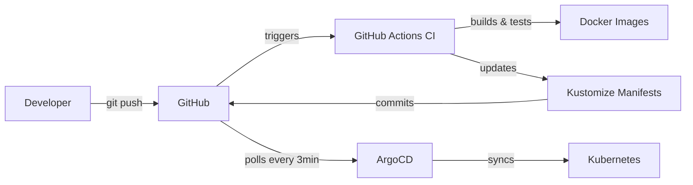

# ArgoCD GitOps Guide

This guide covers the installation, configuration, and usage of ArgoCD for GitOps continuous deployment in the WRight Now project.

## Table of Contents

- [Overview](#overview)
- [Prerequisites](#prerequisites)
- [Installation](#installation)
- [Accessing ArgoCD](#accessing-argocd)
- [Creating Applications](#creating-applications)
- [Deployment Workflow](#deployment-workflow)
- [Rollback Procedure](#rollback-procedure)
- [RBAC and Security](#rbac-and-security)
- [Troubleshooting](#troubleshooting)
- [Best Practices](#best-practices)
- [CLI Reference](#cli-reference)

## Overview

ArgoCD is a declarative GitOps continuous delivery tool for Kubernetes. It automatically synchronizes the state of your Kubernetes cluster with the configuration stored in Git.

### Key Benefits

- **GitOps Workflow**: Git is the single source of truth
- **Automated Deployment**: Pushes to main branch automatically deploy
- **Self-Healing**: Reverts manual kubectl changes to match Git state
- **Easy Rollback**: `git revert` + `git push` = instant rollback
- **Visual Dashboard**: Real-time deployment status and health checks
- **Audit Trail**: Complete deployment history in Git commits

### Architecture

```
Developer → Git Push → GitHub Actions (CI) → Update Manifests → ArgoCD → Deploy to K8s
                             ↓                                      ↓
                      Build & Test Images                   Self-Healing Sync
```

## Prerequisites

Before installing ArgoCD, ensure you have:

- ✅ Kubernetes cluster running (kind, GKE, EKS, AKS, etc.)
- ✅ kubectl installed and configured
- ✅ NGINX Ingress Controller installed
- ✅ Git repository with Kubernetes manifests

## Installation

### Automated Installation (Recommended)

Use the provided setup script:

```bash
# Make script executable (if not already)
chmod +x scripts/argocd-setup.sh

# Run the setup script
./scripts/argocd-setup.sh
```

The script will:
1. Create `argocd` namespace
2. Install ArgoCD components
3. Configure Ingress for UI access
4. Apply RBAC policies
5. Deploy infrastructure Application
6. Display admin credentials

### Manual Installation

If you prefer manual installation:

```bash
# 1. Create namespace
kubectl create namespace argocd

# 2. Install ArgoCD
kubectl apply -n argocd -f https://raw.githubusercontent.com/argoproj/argo-cd/stable/manifests/install.yaml

# 3. Wait for pods to be ready
kubectl wait --for=condition=Ready pods --all -n argocd --timeout=300s

# 4. Apply Ingress configuration
kubectl apply -f k8s/base/argocd/ingress.yaml

# 5. Apply RBAC configuration
kubectl apply -f k8s/base/argocd/rbac-cm.yaml

# 6. Deploy infrastructure Application
kubectl apply -f k8s/base/argocd/applications/infrastructure-app.yaml

# 7. Get initial admin password
kubectl -n argocd get secret argocd-initial-admin-secret \
  -o jsonpath="{.data.password}" | base64 -d && echo
```

## Accessing ArgoCD

### Via Ingress (Recommended)

ArgoCD UI is available at:

**Local (kind cluster):**
```
http://localhost/argocd
```

**Cloud staging:**
```
https://staging.example.com/argocd
```

### Via Port-Forward (Alternative)

If Ingress is not working:

```bash
kubectl port-forward svc/argocd-server -n argocd 8080:443
```

Then access: `https://localhost:8080`

### Login Credentials

**Username:** `admin`

**Password:** Retrieve with:
```bash
kubectl -n argocd get secret argocd-initial-admin-secret \
  -o jsonpath="{.data.password}" | base64 -d
```

**⚠️ Important:** Change the default password after first login!

```bash
# Using ArgoCD CLI
argocd account update-password

# Or via UI: User Info → Update Password
```

## Creating Applications

### Infrastructure Application (Already Created)

The infrastructure Application deploys:
- PostgreSQL database
- Redis cache
- Authentik IdP
- NGINX Ingress Controller

```yaml
# k8s/base/argocd/applications/infrastructure-app.yaml
apiVersion: argoproj.io/v1alpha1
kind: Application
metadata:
  name: infrastructure
  namespace: argocd
spec:
  project: default
  source:
    repoURL: https://github.com/AdityaIndoori/wright-now.git
    targetRevision: main
    path: k8s/overlays/staging
  destination:
    server: https://kubernetes.default.svc
    namespace: staging-infra
  syncPolicy:
    automated:
      prune: true
      selfHeal: true
```

### Creating New Applications

For future services (Core Backend, AI Service, Web Client):

```yaml
apiVersion: argoproj.io/v1alpha1
kind: Application
metadata:
  name: core-backend
  namespace: argocd
spec:
  project: default
  source:
    repoURL: https://github.com/AdityaIndoori/wright-now.git
    targetRevision: main
    path: k8s/overlays/staging
  destination:
    server: https://kubernetes.default.svc
    namespace: staging-core
  syncPolicy:
    automated:
      prune: true
      selfHeal: true
    syncOptions:
      - CreateNamespace=true
```

Apply with:
```bash
kubectl apply -f k8s/base/argocd/applications/core-backend-app.yaml
```

## Deployment Workflow

### Complete GitOps Flow



### Step-by-Step Process

1. **Developer pushes code:**
   ```bash
   git add .
   git commit -m "feat: add new feature"
   git push origin main
   ```

2. **GitHub Actions runs:**
   - Lints and tests code
   - Builds Docker images
   - Pushes images to registry
   - Updates `k8s/overlays/staging/kustomization.yaml` with new image tags
   - Commits and pushes manifest changes

3. **ArgoCD detects changes:**
   - Polls Git repository every 3 minutes
   - Detects manifest changes
   - Calculates diff between Git and cluster

4. **ArgoCD syncs resources:**
   - Applies updated manifests to Kubernetes
   - Waits for resources to be healthy
   - Marks Application as "Synced"

5. **Deployment complete:**
   - New version is live
   - Old pods are terminated
   - Health checks pass

### Manual Sync

To sync immediately without waiting:

**Via UI:**
1. Open ArgoCD UI
2. Click on Application
3. Click "Sync" button
4. Click "Synchronize"

**Via CLI:**
```bash
argocd app sync infrastructure
```

## Rollback Procedure

### Quick Rollback (Git Revert)

The fastest way to rollback:

```bash
# 1. Revert the problematic commit
git revert HEAD

# 2. Push to main branch
git push origin main

# 3. ArgoCD will auto-sync and rollback within 3 minutes
```

### Rollback to Specific Version

```bash
# 1. Find the commit you want to rollback to
git log --oneline

# 2. Revert to that commit
git revert <commit-sha>

# 3. Push to main branch
git push origin main
```

### Manual Rollback via ArgoCD

**Via UI:**
1. Open ArgoCD UI
2. Click on Application
3. Go to "History" tab
4. Find desired revision
5. Click "Rollback"

**Via CLI:**
```bash
# List application history
argocd app history infrastructure

# Rollback to specific revision
argocd app rollback infrastructure <revision-id>
```

## RBAC and Security

### User Roles

ArgoCD has three predefined roles:

**Admin Role:**
- Full permissions (create, update, delete, sync)
- Assigned to: `admin` user

**Developer Role:**
- Can sync and view applications
- Cannot delete applications
- Assigned to: developer users

**Read-Only Role:**
- Can only view applications
- Cannot sync or modify
- Assigned to: observer users

### Managing Users

**Create local user:**

```bash
# Add user to argocd-cm ConfigMap
kubectl edit configmap argocd-cm -n argocd

# Add under data:
accounts.alice: apiKey, login
```

**Assign role:**

```bash
# Edit argocd-rbac-cm
kubectl edit configmap argocd-rbac-cm -n argocd

# Add under policy.csv:
g, alice, role:developer
```

**Set password:**

```bash
argocd account update-password --account alice
```

### SSO Integration (Future)

Post-MVP, we will integrate with Authentik for SSO:

```yaml
# argocd-cm ConfigMap
data:
  url: https://argocd.example.com
  oidc.config: |
    name: Authentik
    issuer: https://auth.example.com/application/o/argocd/
    clientID: $argocd-oidc-client-id
    clientSecret: $argocd-oidc-client-secret
    requestedScopes: ["openid", "profile", "email", "groups"]
```

## Troubleshooting

### Application Won't Sync

**Symptom:** Application status shows "OutOfSync" but won't sync

**Solutions:**

1. Check sync status:
   ```bash
   argocd app get infrastructure
   ```

2. Check for errors:
   ```bash
   kubectl logs -n argocd deployment/argocd-application-controller
   ```

3. Force sync:
   ```bash
   argocd app sync infrastructure --force
   ```

4. Check resource permissions:
   ```bash
   kubectl auth can-i create deployments --as=system:serviceaccount:argocd:argocd-application-controller -n staging-infra
   ```

### Pods Not Starting

**Symptom:** ArgoCD shows "Degraded" health status

**Solutions:**

1. Check pod logs:
   ```bash
   kubectl logs -n staging-infra <pod-name>
   ```

2. Check pod events:
   ```bash
   kubectl describe pod -n staging-infra <pod-name>
   ```

3. Check resource constraints:
   ```bash
   kubectl top pods -n staging-infra
   kubectl top nodes
   ```

### Self-Healing Not Working

**Symptom:** Manual kubectl changes persist

**Solutions:**

1. Check sync policy:
   ```bash
   argocd app get infrastructure -o yaml | grep -A5 syncPolicy
   ```

2. Ensure selfHeal is enabled:
   ```yaml
   syncPolicy:
     automated:
       selfHeal: true  # Should be true
   ```

3. Check controller logs:
   ```bash
   kubectl logs -n argocd deployment/argocd-application-controller | grep self-heal
   ```

### ArgoCD UI Not Accessible

**Symptom:** Cannot access ArgoCD UI via Ingress

**Solutions:**

1. Check Ingress status:
   ```bash
   kubectl get ingress -n argocd
   kubectl describe ingress argocd-server-ingress -n argocd
   ```

2. Check NGINX Ingress Controller:
   ```bash
   kubectl get pods -n ingress-nginx
   kubectl logs -n ingress-nginx deployment/ingress-nginx-controller
   ```

3. Use port-forward as fallback:
   ```bash
   kubectl port-forward svc/argocd-server -n argocd 8080:443
   ```

4. Check ConfigMap for basehref:
   ```bash
   kubectl get configmap argocd-cmd-params-cm -n argocd -o yaml
   ```

### Repository Connection Failed

**Symptom:** ArgoCD cannot fetch manifests from Git

**Solutions:**

1. Check repository credentials:
   ```bash
   argocd repo list
   ```

2. Update repository credentials:
   ```bash
   argocd repo add https://github.com/AdityaIndoori/wright-now.git \
     --username <username> \
     --password <token>
   ```

3. Test Git connectivity from ArgoCD:
   ```bash
   kubectl exec -n argocd deployment/argocd-repo-server -- \
     git ls-remote https://github.com/AdityaIndoori/wright-now.git
   ```

## Best Practices

### 1. Always Use Git for Changes

❌ **Don't:**
```bash
kubectl edit deployment myapp -n staging-core
```

✅ **Do:**
```bash
# Edit manifest in Git
vim k8s/base/core/deployment.yaml

# Commit and push
git add k8s/base/core/deployment.yaml
git commit -m "fix: update deployment replicas"
git push origin main

# ArgoCD will sync automatically
```

### 2. Use Separate Applications

- Separate infrastructure from application services
- One Application per logical service group
- Easier to manage sync policies and permissions

### 3. Enable Auto-Sync for Staging

```yaml
syncPolicy:
  automated:
    prune: true
    selfHeal: true
```

### 4. Use Manual Sync for Production

```yaml
syncPolicy:
  syncOptions:
    - CreateNamespace=true
  # No automated: field = manual sync required
```

### 5. Monitor Application Health

- Check ArgoCD UI daily
- Set up alerts for "Degraded" status
- Review sync history regularly

### 6. Use Sync Waves for Ordering

```yaml
metadata:
  annotations:
    argocd.argoproj.io/sync-wave: "1"  # Deploy before wave 2
```

### 7. Ignore Ephemeral Differences

```yaml
ignoreDifferences:
  - group: apps
    kind: Deployment
    jsonPointers:
      - /spec/replicas  # Ignore HPA changes
```

### 8. Keep Secrets Out of Git

Use Sealed Secrets or External Secrets Operator:

```yaml
# Use sealed-secrets (recommended)
apiVersion: bitnami.com/v1alpha1
kind: SealedSecret
metadata:
  name: mysecret
spec:
  encryptedData:
    password: AgBy3i4OJSWK+PiTySYZZA9rO43cGDEq...
```

## CLI Reference

### Common Commands

```bash
# Login
argocd login <server> --username admin

# List applications
argocd app list

# Get application details
argocd app get <app-name>

# Sync application
argocd app sync <app-name>

# Watch sync status
argocd app sync <app-name> --watch

# Get application history
argocd app history <app-name>

# Rollback application
argocd app rollback <app-name> <revision>

# Delete application
argocd app delete <app-name>

# List repositories
argocd repo list

# Add repository
argocd repo add <repo-url>

# List clusters
argocd cluster list

# Get application logs
argocd app logs <app-name>

# Get pod logs
argocd app logs <app-name> --pod <pod-name>
```

### Advanced Commands

```bash
# Diff application
argocd app diff <app-name>

# Terminate sync operation
argocd app terminate-op <app-name>

# Patch application
argocd app patch <app-name> --patch '{"spec":{"syncPolicy":null}}'

# Set parameters
argocd app set <app-name> --parameter key=value

# Wait for application to be synced
argocd app wait <app-name> --sync

# Create application from YAML
argocd app create -f app.yaml

# Export application as YAML
argocd app get <app-name> -o yaml > app.yaml
```

## Next Steps

After setting up ArgoCD:

1. ✅ Verify infrastructure Application is synced
2. ✅ Test the CD workflow by pushing a change
3. ✅ Practice rollback procedure
4. ⏭️ Create Applications for Core Backend (Sprint 3)
5. ⏭️ Create Applications for AI Service (Sprint 5)
6. ⏭️ Create Applications for Web Client (Sprint 3)
7. ⏭️ Set up monitoring and alerting (Post-MVP)
8. ⏭️ Configure SSO with Authentik (Post-MVP)

## Additional Resources

- [ArgoCD Official Documentation](https://argo-cd.readthedocs.io/)
- [GitOps Principles](https://opengitops.dev/)
- [Kustomize Documentation](https://kustomize.io/)
- [Kubernetes Best Practices](https://kubernetes.io/docs/concepts/cluster-administration/manage-deployment/)

---

**Questions?** Check the [troubleshooting section](#troubleshooting) or consult the team.
