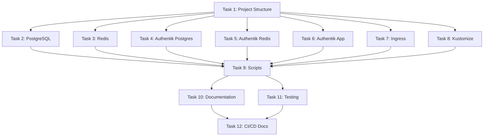

# Tasks: Add Kubernetes Staging Cluster Configuration

**Change ID:** `2025-11-11-add-kubernetes-staging-cluster`  
**Status:** Proposed  
**Sprint:** Sprint 0 - Task 1.4

## Implementation Checklist

### Phase 1: Project Structure (Tasks 1-5)

- [ ] **Task 1.1:** Create `k8s/` directory structure
  - Create `k8s/base/` for base manifests
  - Create `k8s/base/namespaces/` for namespace definitions
  - Create `k8s/base/postgres/` for PostgreSQL manifests
  - Create `k8s/base/redis/` for Redis manifests
  - Create `k8s/base/authentik/` for Authentik manifests
  - Create `k8s/base/ingress/` for ingress controller
  - Create `k8s/overlays/local/` for local development overlay

- [ ] **Task 1.2:** Create namespace definitions
  - Create `k8s/base/namespaces/staging-infra.yaml` (active namespace)
  - Create `k8s/base/namespaces/staging-core.yaml` (placeholder with annotations)
  - Create `k8s/base/namespaces/staging-ai.yaml` (placeholder with annotations)
  - Create `k8s/base/namespaces/staging-web.yaml` (placeholder with annotations)
  - Add labels: `environment: staging`, `status: placeholder` (for placeholders)
  - Add annotations referencing Sprint tasks and deployment guides

- [ ] **Task 1.3:** Create `.gitignore` entries for secrets
  - Add `k8s/**/*-secrets.yaml` to ignore real credentials
  - Add `k8s/**/*-secret.yaml` to ignore real credentials
  - Keep `k8s/**/*-secrets.example.yaml` tracked

- [ ] **Task 1.4:** Update root `.gitignore` for kind
  - Add `*.kubeconfig` to ignore cluster config files
  - Add `.kube/` if created in project root

- [ ] **Task 1.5:** Create kind cluster configuration
  - Create `k8s/overlays/local/kind-cluster-config.yaml`
  - Configure extraPortMappings for ingress (80:80, 443:443)
  - Set Kubernetes version (v1.27.0 or latest stable)
  - Configure node labels if needed

### Phase 2: PostgreSQL Database (Tasks 6-9)

- [ ] **Task 2.1:** Create PostgreSQL StatefulSet
  - Create `k8s/base/postgres/statefulset.yaml`
  - Use image: `pgvector/pgvector:pg15`
  - Configure volumeClaimTemplates for data persistence (10Gi)
  - Set resource requests (250m CPU, 256Mi memory)
  - Set resource limits (500m CPU, 512Mi memory)
  - Configure liveness probe: `pg_isready -U postgres`
  - Configure readiness probe: `pg_isready -U postgres`
  - Reference ConfigMap for non-sensitive config
  - Reference Secret for credentials

- [ ] **Task 2.2:** Create PostgreSQL Service
  - Create `k8s/base/postgres/service.yaml`
  - Type: ClusterIP (internal only)
  - Port: 5432
  - Headless service for StatefulSet (clusterIP: None)
  - Selector: `app: postgres`

- [ ] **Task 2.3:** Create PostgreSQL ConfigMap
  - Create `k8s/base/postgres/configmap.yaml`
  - Add init-db.sh script (from docker-compose)
  - Add any PostgreSQL configuration overrides

- [ ] **Task 2.4:** Create PostgreSQL Secret example
  - Create `k8s/base/postgres/secrets.example.yaml`
  - Add placeholders for: POSTGRES_DB, POSTGRES_USER, POSTGRES_PASSWORD
  - Document base64 encoding instructions in comments
  - Add note about creating real secrets.yaml (gitignored)

### Phase 3: Redis Cache (Tasks 10-12)

- [ ] **Task 3.1:** Create Redis Deployment
  - Create `k8s/base/redis/deployment.yaml`
  - Use image: `redis:7-alpine`
  - Configure command: `redis-server --appendonly yes --appendfsync everysec`
  - Configure PersistentVolumeClaim for AOF data (2Gi)
  - Set resource requests (100m CPU, 128Mi memory)
  - Set resource limits (250m CPU, 256Mi memory)
  - Configure liveness probe: `redis-cli ping`
  - Configure readiness probe: `redis-cli ping`

- [ ] **Task 3.2:** Create Redis Service
  - Create `k8s/base/redis/service.yaml`
  - Type: ClusterIP (internal only)
  - Port: 6379
  - Selector: `app: redis`

- [ ] **Task 3.3:** Create Redis PersistentVolumeClaim
  - Create `k8s/base/redis/pvc.yaml`
  - Request 2Gi storage
  - AccessMode: ReadWriteOnce
  - StorageClass: standard (kind default)

### Phase 4: Authentik PostgreSQL (Tasks 13-15)

- [ ] **Task 4.1:** Create Authentik PostgreSQL StatefulSet
  - Create `k8s/base/authentik/postgres-statefulset.yaml`
  - Use image: `postgres:15-alpine`
  - Configure volumeClaimTemplates for data persistence (5Gi)
  - Set resource requests (250m CPU, 256Mi memory)
  - Set resource limits (500m CPU, 512Mi memory)
  - Configure liveness probe: `pg_isready -U authentik`
  - Configure readiness probe: `pg_isready -U authentik`
  - Reference Secret for credentials

- [ ] **Task 4.2:** Create Authentik PostgreSQL Service
  - Create `k8s/base/authentik/postgres-service.yaml`
  - Type: ClusterIP (internal only)
  - Port: 5432
  - Headless service for StatefulSet
  - Selector: `app: authentik-postgres`

- [ ] **Task 4.3:** Create Authentik PostgreSQL Secret example
  - Add to `k8s/base/authentik/secrets.example.yaml`
  - Add placeholders for: AUTHENTIK_POSTGRESQL__HOST, NAME, USER, PASSWORD

### Phase 5: Authentik Redis (Tasks 16-18)

- [ ] **Task 5.1:** Create Authentik Redis Deployment
  - Create `k8s/base/authentik/redis-deployment.yaml`
  - Use image: `redis:7-alpine`
  - Configure command: `redis-server --save 60 1 --loglevel warning`
  - Configure PersistentVolumeClaim for RDB data (1Gi)
  - Set resource requests (100m CPU, 128Mi memory)
  - Set resource limits (250m CPU, 256Mi memory)
  - Configure liveness probe: `redis-cli ping`
  - Configure readiness probe: `redis-cli ping`

- [ ] **Task 5.2:** Create Authentik Redis Service
  - Create `k8s/base/authentik/redis-service.yaml`
  - Type: ClusterIP (internal only)
  - Port: 6379
  - Selector: `app: authentik-redis`

- [ ] **Task 5.3:** Create Authentik Redis PersistentVolumeClaim
  - Add to `k8s/base/authentik/pvcs.yaml`
  - Request 1Gi storage for Redis
  - Request 2Gi storage for authentik-media volume
  - AccessMode: ReadWriteOnce

### Phase 6: Authentik Application (Tasks 19-22)

- [ ] **Task 6.1:** Create Authentik Server Deployment
  - Create `k8s/base/authentik/server-deployment.yaml`
  - Use image: `ghcr.io/goauthentik/server:latest`
  - Configure command: `server`
  - Set replicas: 2 (high availability)
  - Set resource requests (250m CPU, 256Mi memory)
  - Set resource limits (500m CPU, 512Mi memory)
  - Configure startup probe: HTTP /api/v3/ (slow startup, 60s delay)
  - Configure liveness probe: HTTP /api/v3/
  - Configure readiness probe: HTTP /api/v3/
  - Reference Secret for all environment variables
  - Mount authentik-media PVC

- [ ] **Task 6.2:** Create Authentik Worker Deployment
  - Create `k8s/base/authentik/worker-deployment.yaml`
  - Use image: `ghcr.io/goauthentik/server:latest`
  - Configure command: `worker`
  - Set replicas: 1
  - Set resource requests (100m CPU, 128Mi memory)
  - Set resource limits (250m CPU, 256Mi memory)
  - Reference Secret for all environment variables
  - Mount authentik-media PVC (shared with server)

- [ ] **Task 6.3:** Create Authentik Server Service
  - Add to `k8s/base/authentik/services.yaml`
  - Type: ClusterIP (accessed via Ingress)
  - Ports: 9000 (http), 9443 (https)
  - Selector: `app: authentik-server`

- [ ] **Task 6.4:** Create Authentik Secrets example
  - Complete `k8s/base/authentik/secrets.example.yaml`
  - Add: AUTHENTIK_SECRET_KEY, AUTHENTIK_ERROR_REPORTING__ENABLED
  - Add: PostgreSQL connection details
  - Add: Redis connection details
  - Document base64 encoding for all values

### Phase 7: Ingress Configuration (Tasks 23-24)

- [ ] **Task 7.1:** Create nginx-ingress controller reference
  - Create `k8s/base/ingress/nginx-ingress-controller.yaml`
  - Document official nginx-ingress installation URL
  - Note: Installed via `kubectl apply -f https://...` in setup script
  - Add comments about kind-specific configuration

- [ ] **Task 7.2:** Create Authentik Ingress
  - Create `k8s/base/authentik/ingress.yaml`
  - Configure host: `localhost` (local development)
  - Configure path: `/auth/` → authentik-server:9000
  - Add annotations: `nginx.ingress.kubernetes.io/rewrite-target: /`
  - Set ingressClassName: `nginx`

### Phase 8: Kustomize Configuration (Tasks 25-26)

- [ ] **Task 8.1:** Create base kustomization
  - Create `k8s/base/kustomization.yaml`
  - Add resources: namespaces, postgres, redis, authentik
  - Set namespace: staging-infra (default)
  - Add commonLabels: `managed-by: kustomize`, `environment: staging`

- [ ] **Task 8.2:** Create local overlay kustomization
  - Create `k8s/overlays/local/kustomization.yaml`
  - Set bases: `../../base`
  - Add patches for local-specific configuration (if any)
  - Document structure for future overlays (staging, production)

### Phase 9: Cluster Management Scripts (Tasks 27-29)

- [ ] **Task 9.1:** Create cluster setup script
  - Create `scripts/k8s-setup.sh`
  - Check for kind binary (exit if not found)
  - Create kind cluster with config: `kind create cluster --config k8s/overlays/local/kind-cluster-config.yaml --name wrightnow`
  - Install nginx-ingress: `kubectl apply -f https://raw.githubusercontent.com/kubernetes/ingress-nginx/main/deploy/static/provider/kind/deploy.yaml`
  - Wait for ingress-nginx to be ready: `kubectl wait --namespace ingress-nginx --for=condition=ready pod --selector=app.kubernetes.io/component=controller --timeout=90s`
  - Make script executable: `chmod +x scripts/k8s-setup.sh`

- [ ] **Task 9.2:** Create deployment script
  - Create `scripts/k8s-deploy.sh`
  - Check for kubectl binary (exit if not found)
  - Apply Kustomize configuration: `kubectl apply -k k8s/overlays/local`
  - Wait for all pods in staging-infra to be ready: `kubectl wait --namespace staging-infra --for=condition=ready pod --all --timeout=300s`
  - Print status: `kubectl get pods -n staging-infra`
  - Print ingress info: `kubectl get ingress -n staging-infra`
  - Make script executable: `chmod +x scripts/k8s-deploy.sh`

- [ ] **Task 9.3:** Create teardown script
  - Create `scripts/k8s-teardown.sh`
  - Check for kind binary (exit if not found)
  - Delete kind cluster: `kind delete cluster --name wrightnow`
  - Confirm deletion: `kind get clusters` (should not list wrightnow)
  - Make script executable: `chmod +x scripts/k8s-teardown.sh`

### Phase 10: Documentation (Tasks 30-32)

- [ ] **Task 10.1:** Create Kubernetes README
  - Create `k8s/README.md`
  - Document cluster architecture (namespaces, services)
  - Add quick start guide (setup, deploy, teardown)
  - Document placeholder namespaces with deployment instructions
  - Add section: "Deploying Core Backend (Sprint 0 Task 3.1)"
    - Copy StatefulSet/Deployment pattern from existing services
    - Update Ingress to route `/api/` to new service
    - Reference this section in staging-core namespace annotations
  - Add section: "Deploying AI Service (Sprint 0 Task 3.2)"
    - Follow same pattern, route `/ai/` to new service
    - Reference in staging-ai namespace annotations
  - Add section: "Deploying Web Client (Sprint 0 Task 3.3)"
    - Follow same pattern, route `/` to new service
    - Reference in staging-web namespace annotations
  - Document troubleshooting (pods not starting, ingress not working)
  - Add resource requirements (8GB RAM, 4 CPU cores minimum)

- [ ] **Task 10.2:** Create comprehensive setup guide
  - Create `docs/kubernetes-setup.md`
  - Prerequisites: Docker Desktop, kind, kubectl
  - Step-by-step local development setup
  - Cloud migration guide (GKE, EKS, AKS)
  - Common issues and solutions
  - Security best practices (Secrets management)

- [ ] **Task 10.3:** Update main README
  - Update `README.md` to mention Kubernetes option
  - Add section: "Local Development with Kubernetes"
  - Link to `docs/kubernetes-setup.md`
  - Add badges for Kubernetes (if applicable)

### Phase 11: Testing and Validation (Tasks 33-37)

- [ ] **Task 11.1:** Validate YAML syntax
  - Run: `kubectl apply --dry-run=client -k k8s/base`
  - Fix any YAML syntax errors
  - Ensure all resources are valid Kubernetes objects

- [ ] **Task 11.2:** Test cluster creation
  - Run: `./scripts/k8s-setup.sh`
  - Verify cluster exists: `kind get clusters` (should show "wrightnow")
  - Verify nodes ready: `kubectl get nodes` (should show Ready)
  - Verify ingress-nginx installed: `kubectl get pods -n ingress-nginx`

- [ ] **Task 11.3:** Test service deployment
  - Run: `./scripts/k8s-deploy.sh`
  - Verify all namespaces created: `kubectl get namespaces`
  - Verify all pods running: `kubectl get pods -n staging-infra`
  - Check pod logs for errors: `kubectl logs -n staging-infra <pod-name>`

- [ ] **Task 11.4:** Test service connectivity
  - PostgreSQL: `kubectl exec -it postgres-0 -n staging-infra -- psql -U postgres -c "\l"`
  - Redis: `kubectl exec -it redis-<pod> -n staging-infra -- redis-cli ping`
  - Authentik API: `curl http://localhost/auth/api/v3/`
  - All tests should succeed

- [ ] **Task 11.5:** Test data persistence
  - Create test data in PostgreSQL
  - Delete pod: `kubectl delete pod postgres-0 -n staging-infra`
  - Wait for pod to restart
  - Verify data still exists
  - Run: `./scripts/k8s-teardown.sh` and `./scripts/k8s-setup.sh`
  - Verify data persists across cluster recreation (PVCs retained)

- [ ] **Task 11.6:** Test cluster teardown
  - Run: `./scripts/k8s-teardown.sh`
  - Verify cluster deleted: `kind get clusters` (should not show "wrightnow")
  - Verify Docker cleanup: `docker ps -a` (no leftover containers)

- [ ] **Task 11.7:** Validate with OpenSpec
  - Run: `openspec validate 2025-11-11-add-kubernetes-staging-cluster --strict`
  - Fix any validation errors
  - Ensure all requirements in spec have scenarios

### Phase 12: CI/CD Integration (Task 38)

- [ ] **Task 12.1:** Document CI/CD integration
  - Add notes to `k8s/README.md` for CI/CD usage
  - Document GitHub Actions workflow integration (future Task 1.2 update)
  - Note: CI can use kind for integration testing
  - Add example: `kind create cluster && kubectl apply -k k8s/overlays/local`

## Task Dependencies

## Completion Criteria

- [ ] All 38 tasks completed and checked off
- [ ] `./scripts/k8s-setup.sh` creates cluster successfully
- [ ] `./scripts/k8s-deploy.sh` deploys all services successfully
- [ ] All pods in staging-infra namespace are Running and Ready
- [ ] Authentik UI accessible at `http://localhost/auth/`
- [ ] Data persists across pod restarts
- [ ] Documentation is comprehensive and accurate
- [ ] Placeholder namespaces (staging-core, staging-ai, staging-web) exist with proper annotations
- [ ] `openspec validate --strict` passes with no errors
- [ ] Ready to proceed with Sprint 0 Task 1.5 (ArgoCD)

## Estimated Timeline

- **Phase 1-2 (Structure + PostgreSQL):** 4 hours
- **Phase 3-6 (Redis + Authentik):** 6 hours
- **Phase 7-8 (Ingress + Kustomize):** 2 hours
- **Phase 9 (Scripts):** 2 hours
- **Phase 10 (Documentation):** 4 hours
- **Phase 11 (Testing):** 3 hours
- **Phase 12 (CI/CD Docs):** 1 hour

**Total Estimated Time:** 22 hours (2-3 days)

## Notes for Future Sprints

### Sprint 0 Task 3.1 (Nest.js Core Backend)
When implementing, reference this change:
- Namespace `staging-core` already exists (placeholder)
- Follow deployment pattern from `k8s/base/authentik/server-deployment.yaml`
- Update Ingress to route `/api/` to new service
- See `k8s/README.md#deploying-core-backend` for detailed guide

### Sprint 0 Task 3.2 (FastAPI AI Service)
When implementing, reference this change:
- Namespace `staging-ai` already exists (placeholder)
- Follow deployment pattern from existing services
- Update Ingress to route `/ai/` to new service
- See `k8s/README.md#deploying-ai-service` for detailed guide

### Sprint 0 Task 3.3 (React Web Client)
When implementing, reference this change:
- Namespace `staging-web` already exists (placeholder)
- Follow deployment pattern, but use nginx as reverse proxy
- Update Ingress to route `/` to new service
- See `k8s/README.md#deploying-web-client` for detailed guide

### Sprint 0 Task 1.5 (ArgoCD GitOps)
This task depends on completion of this change:
- ArgoCD will monitor `k8s/` directory in Git
- ArgoCD will auto-deploy changes on Git push
- See ArgoCD documentation for setup
